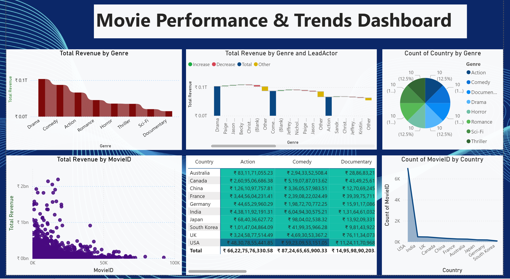

# Movie Insight Report
🎬 Movie Revenue Insights Dashboard

The Movie Revenue Insights Dashboard provides a comprehensive analytical view of the global movie industry, focusing on revenue, profit, budget efficiency, genre performance, and geographical distribution. It is designed to help analysts and decision-makers understand key financial trends and performance indicators in the film industry.

## Features
- Exploratory data analysis (EDA) of movie datasets
- Visualizations for ratings, revenue, genre trends, and release-year distributions
- Summary tables and key metrics
- Exportable figures and report-ready assets

## Dataset
Describe the dataset(s) used in this project here. If you're using a public dataset (e.g., Kaggle, TMDb, IMDB), list the source and any preprocessing steps.

Example:
- Source: Kaggle "movies-recommendation" (replace with the actual source used)
- Preprocessing: cleaned missing values, normalized release dates, parsed genres into lists

## Screenshots
## Dashboard 1

:

🔹 Key Metrics Overview

The dashboard highlights important KPIs at the top:

Total Revenue: ₹409 Billion across all movies

Record Count: 9,665 movies analyzed

Profit Margin: 77% overall profitability

Average Budget: ₹10 Million per movie

Profit per Budget: 3.37 (efficiency indicator)

Rating–Revenue Correlation: 0.0089 (very weak correlation)

Average ROI: 336.51%, indicating strong returns on investment

🔹 Revenue & Profit Analysis

A detailed table displays movie-wise revenue along with genre classification.

Total Profit by Genre shows that Drama and Comedy are the most profitable genres, followed by Action, Romance, and Horror.

Total Profit by Release Year visualizes profit trends over time, revealing a steady increase in movie profitability in recent years.

🔹 Genre Distribution

The Count of Movies by Genre donut chart shows Drama as the most produced genre, followed by Comedy and Action.

This helps understand market saturation and genre popularity.

🔹 Country-wise Insights

IMDb Rating by Country highlights the contribution of different countries, with the USA leading significantly.

Total Revenue by Country is presented using a geographic map, providing a global perspective on movie earnings.

🔹 Interactive Features

Genre Filter and Country Filter allow users to dynamically explore insights based on specific selections.

All visuals are interconnected, enabling interactive and drill-down analysis.

📊 Tools & Technologies

Built using Power BI

Data visualization includes cards, bar charts, line charts, donut charts, tables, and maps.

🚀 Use Case

This dashboard is ideal for:

Movie industry analysis

Business and revenue insights

Academic and data science projects

---
## Dashboard 2

📊 Movie Performance & Trends Dashboard

The Movie Performance & Trends Dashboard provides an in-depth analysis of movie revenues, genre performance, lead actor contributions, and country-wise distribution. It helps identify revenue trends, high-performing genres, and regional patterns within the global film industry.

🔹 Genre-Wise Revenue Analysis

Total Revenue by Genre visualizes how different genres perform financially.

Drama and Comedy emerge as top-revenue-generating genres, followed by Action and Romance.

Lower revenue contributions are observed in Sci-Fi and Documentary, indicating niche market segments.

🔹 Genre & Lead Actor Contribution

Total Revenue by Genre and Lead Actor breaks down revenue contributions by lead actors within each genre.

The waterfall chart highlights revenue increases and decreases, helping track actor-level impact on genre performance.

Useful for understanding how star power influences movie earnings.

🔹 Country & Genre Distribution

Count of Country by Genre shows the distribution of genres across countries.

The balanced pie chart indicates that multiple genres are produced consistently across regions.

🔹 Movie-Level Revenue Insights

Total Revenue by MovieID scatter plot displays revenue variation at the individual movie level.

A small number of movies generate exceptionally high revenue, while the majority fall within lower revenue ranges, reflecting a long-tail revenue distribution.

🔹 Country-Wise Revenue Matrix

The country vs genre table provides detailed revenue figures for Action, Comedy, and Documentary genres.

The USA leads in total revenue across all genres, followed by India, UK, and China.

This matrix supports cross-country and cross-genre performance comparisons.

🔹 Movie Production by Country

Count of MovieID by Country line chart highlights movie production volume by country.

The USA dominates in movie count, with a steep drop for other countries, indicating industry concentration.

⚙️ Tools & Technologies

Power BI for data visualization and dashboard development

Interactive visuals: bar charts, waterfall charts, pie charts, scatter plots, tables, and line charts

🎯 Use Cases

Movie industry trend analysis

Revenue and performance benchmarking

Data analytics and Power BI portfolio projects

Academic and business intelligence case studies
---

## Google drive link

https://drive.google.com/file/d/1VofPs6tal6OgDlI_r5xFOW_SLRhep3vz/view?usp=drive_link
https://drive.google.com/file/d/1vv4LfOQs0D4GABSBDFkiQDM8Dqzr4WuD/view?usp=drive_link,
https://docs.google.com/presentation/d/1LveT5Teva6n37viCij6J2vxTzG0eB_tM/edit?usp=drive_link&ouid=108426022065190021286&rtpof=true&sd=true

---

## Contact
- Maintainer: Krishnkundan
- LinkedIn: [Your LinkedIn Profile](https://www.linkedin.com/in/krishn-kundan-bhardwaj-9804a6295/) 

---
